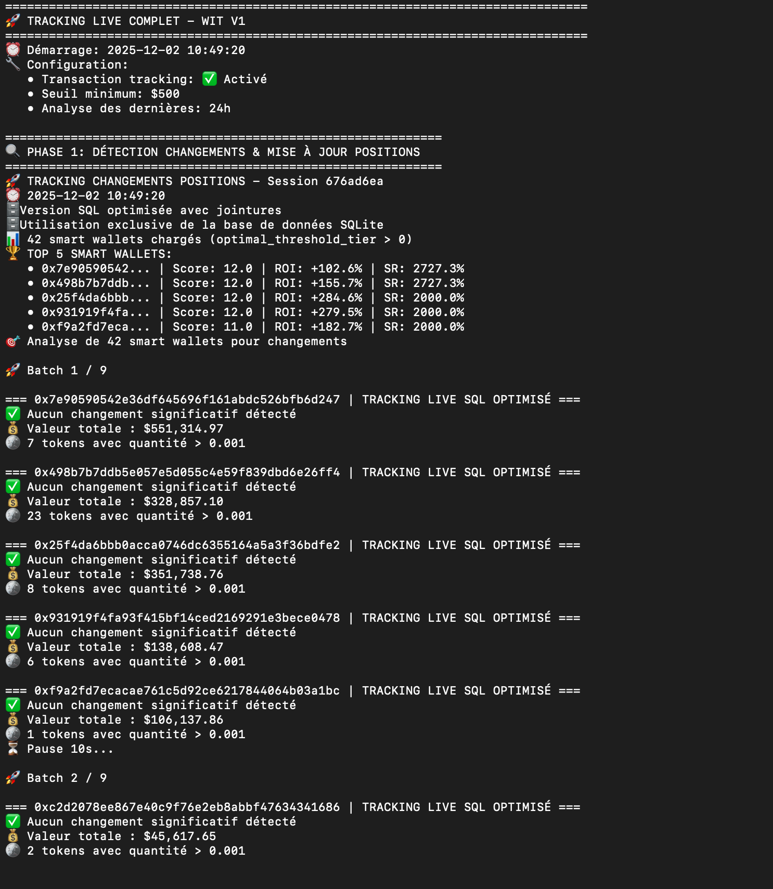
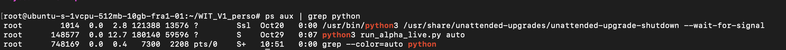

# WIT V1 - Wallet Intelligence Toolkit

<p align="center">
  
  
  
</p>

Smart wallet tracking and token discovery system for cryptocurrency market analysis.

## Overview

WIT (Wallet Intelligence Toolkit) is a comprehensive system designed to track high-performing crypto wallets, discover promising tokens, and provide real-time trading signals through Telegram notifications.

## System in Action

### Live Wallet Tracking Pipeline
<p align="center">
  
</p>

*Real-time tracking of 42 smart wallets with position detection, scoring, and batch processing*

### Production Deployment
<p align="center">
  
</p>

*System running on VPS with automated detection cycles*

## Features

- **Token Discovery**: Identify top-performing tokens across multiple chains (Base, BNB, Ethereum)
- **Wallet Tracking**: Monitor wallet transactions and balances in real-time
- **Scoring Engine**: Advanced FIFO-based wallet scoring and analysis
- **Backtesting**: Test trading strategies with historical data
- **Consensus Detection**: Identify when multiple tracked wallets buy the same token
- **Live Tracking**: Real-time monitoring with Zerion API integration
- **Telegram Bot**: Receive instant notifications for trading opportunities

## Project Structure

```
WIT_V1_perso/
├── module/
│   ├── token_discovery/         # Token discovery and analysis
│   ├── token_discovery_manual/  # Manual token discovery tools
│   ├── wallet_tracker/          # Wallet tracking and processing
│   ├── tracking_live/           # Real-time wallet monitoring
│   ├── score_engine/            # Wallet scoring algorithms
│   ├── backtesting_engine/      # Strategy backtesting
│   ├── consensus_live/          # Consensus detection
│   ├── price_analysis/          # Price fetching and analysis
│   ├── graphe_engine/           # Network graph analysis
│   ├── entity_resolver/         # Entity identification
│   └── Telegram/                # Telegram bot integration
├── db/                          # Database utilities and setup
├── data/                        # Data storage (ignored in git)
└── alpha_live.py               # Main live trading bot
```

## Installation

1. Clone the repository:
```bash
git clone https://github.com/Bilal27fx/WIT_V1.git
cd WIT_V1_perso
```

2. Create a virtual environment:
```bash
python -m venv venv
source venv/bin/activate  # On Windows: venv\Scripts\activate
```

3. Install dependencies:
```bash
pip install -r requirements.txt
```

4. Configure environment variables:
```bash
cp .env.example .env
# Edit .env with your API keys
```

## Configuration

Create a `.env` file with the following API keys:

- **GOLDRUSH_API_KEY**: For blockchain data
- **DUNE_API_KEY**: For Dune Analytics queries
- **CG_API_KEY**: CoinGecko API key
- **ETHERSCAN_API_KEY**: Etherscan API key
- **ALCHEMY_API_KEY**: Alchemy node provider
- **ZERION_API_KEY**: For wallet tracking
- **TELEGRAM_BOT_TOKEN**: For Telegram notifications
- **TELEGRAM_CHANNEL_ID**: Your Telegram channel ID

## Usage

### Token Discovery
```bash
python -m module.token_discovery.run
```

### Wallet Tracking
```bash
python -m module.wallet_tracker.run
```

### Live Trading Bot
```bash
python run_alpha_live.py
```

### Backtesting
```bash
python -m module.backtesting_engine.consensus_backtesting_simple
```

## Database

The project uses SQLite for data storage. Initialize the database with:

```bash
python db/create_simple_tables.py
```

## Data Sources

- Dune Analytics for token performance data
- Zerion API for real-time wallet tracking
- Etherscan for entity resolution
- CoinGecko for price data

## Contributing

This is a personal research project. Feel free to fork and adapt to your needs.

## Disclaimer

This tool is for educational and research purposes only. Cryptocurrency trading carries significant risk. Always do your own research and never invest more than you can afford to lose.

## License

Private project - All rights reserved

## Contact

For questions or collaboration: bilalmeziane97@gmail.com
