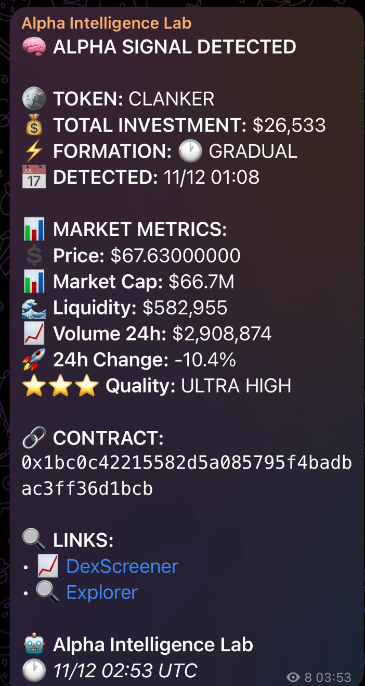

# WIT V1 — Wallet Intelligence Toolkit

> Identify, analyze, and monitor high-performing crypto wallets in real time.

WIT V1 is a Python-based analytics pipeline that discovers "smart wallets" (consistently profitable on-chain traders), scores them using FIFO accounting and multi-dimensional metrics, tracks their positions live, and fires Telegram alerts when multiple elite wallets converge on the same token.

---

## What it does

1. **Discovers** wallets that held explosive tokens early — via Dune Analytics
2. **Qualifies** them with FIFO accounting, ROI scoring, and tier analysis
3. **Tracks** their balances in real time via the Zerion API
4. **Detects consensus** when 2+ smart wallets buy the same token
5. **Alerts** immediately via Telegram

---

## Pipeline overview

```
Token Discovery (Dune)
        ↓
  Wallet Brute DB
        ↓
  Wallet Tracker (Zerion)
        ↓
  Transaction History (SQLite)
        ↓
  FIFO Analysis → Token Analytics
        ↓
  Wallet Scoring → Qualified Wallets
        ↓
  Tier Analysis → Smart Wallets
        ↓
  Tracking Live (every 2h)
        ↓
  Consensus Detector → Telegram Alert
```

---

## Live tracking in action

Pipeline running on a VPS, processing  smart wallets in real time:


Workflow running continuously on the server:


Telegram alert fired when a consensus signal is detected:



---

## Project structure

```
WIT_V1_perso/
├── run_pipelines.py                     # Main entry point & CLI menu
├── requirements.txt
├── .env                                 # API keys (not committed)
├── smart_wallet_analysis/
│   ├── config.py                        # Central configuration (single source of truth)
│   ├── logger.py
│   ├── discovery_pipeline_runner.py     # Discovery → Tracker → Scoring
│   ├── scoring_pipeline_runner.py       # Daily re-scoring
│   ├── run_smartwallets_pipeline.py     # Full end-to-end pipeline
│   ├── token_discovery_manual/          # Dune + explosion detection
│   ├── wallet_tracker/                  # Zerion portfolio & tx fetcher
│   ├── score_engine/                    # FIFO, scoring, tier & threshold analysis
│   ├── tracking_live/                   # Real-time balance monitoring
│   ├── consensus_live/                  # Consensus signal detection
│   ├── backtesting_engine/              # Signal validation
│   └── Telegram/                        # Alert bot
├── data/
│   ├── db/wit_database.db               # SQLite database
│   ├── logs/
│   └── backtesting/
└── assets/
```

---

## Modules

### Token Discovery
Queries Dune Analytics for top tokens over configurable periods (14d / 30d / 200d / 360d), detects explosive price moves (200%+), extracts early holder wallet addresses, and filters out smart contracts (EOA only).

### Wallet Tracker
Fetches current portfolio balances and complete transaction history from the Zerion API. Stores everything in SQLite with deduplication via `INSERT OR IGNORE` on transaction hash.

### Score Engine (4 steps)
| Step | File | Output |
|------|------|--------|
| FIFO Analysis | `fifo_clean_simple.py` | `token_analytics` |
| Wallet Scoring | `wallet_scoring_system.py` | `wallet_qualified` |
| Tier Analysis | `simple_wallet_analyzer.py` | `wallet_tier_performance` |
| Optimal Threshold | `optimal_threshold_analyzer.py` | `smart_wallets` |

**Scoring formula:** `60% ROI + 30% win rate + 10% activity`

**Tier analysis:** tests investment thresholds from $3K to $12K per wallet to find the optimal entry size.

### Tracking Live
Every 2 hours, fetches updated balances for all smart wallets. Detects `NEW / ACCUMULATION / REDUCTION / EXIT` position changes, rebuilds transaction history for affected tokens, and logs every change to `wallet_position_changes`.

### Consensus Detector
Groups recent purchases by token. Fires a signal when 2+ smart wallets bought the same token within the lookback window (market cap $100K–$100M, stablecoins excluded).

### Backtesting Engine
Validates historical consensus signals: hit rate, average return, and performance over time.

---

## Database schema

**SQLite — `data/db/wit_database.db`**

| Table | Purpose |
|-------|---------|
| `wallet_brute` | Raw wallet/token pairs from discovery |
| `wallets` | Tracked wallet registry |
| `tokens` | Current positions (amount, USD value) |
| `transaction_history` | All trades — append-only, deduped by hash |
| `wallet_position_changes` | Live change log per session |
| `token_analytics` | FIFO results per wallet × token |
| `wallet_tier_performance` | ROI/winrate at each investment tier |
| `wallet_qualified` | Wallets that passed qualification |
| `smart_wallets` | Elite wallets with optimal threshold |

---

## Setup

### 1. Clone & install

```bash
git clone <repo-url>
cd WIT_V1_perso
pip install -r requirements.txt
```

### 2. Configure environment

Create a `.env` file at the root:

```env
ZERION_API_KEY=your_zerion_key
ZERION_API_KEY_2=your_zerion_backup_key
DUNE_API_KEY=your_dune_key
ETHERSCAN_API_KEY=your_etherscan_key
ALCHEMY_API_KEY=your_alchemy_key
CG_API_KEY=your_coingecko_key
TELEGRAM_BOT_TOKEN=your_bot_token
TELEGRAM_CHANNEL_ID=your_channel_id
```

### 3. Initialize the database

```bash
python db/create_simple_tables.py
```

---

## Usage

### Interactive menu

```bash
python run_pipelines.py menu
```

```
1) Discovery Pipeline    — tokens → wallets → scoring
2) Scoring Pipeline      — re-score existing wallets
3) Smart Wallets Live    — full analysis pipeline
4) Consensus Detector    — find group buys
5) Backtesting           — validate historical signals
6) Scheduler             — automatic execution
```

### Individual components

```bash
# Full discovery pipeline
python run_pipelines.py discovery

# Re-score wallets
python run_pipelines.py scoring

# Smart wallets + consensus + Telegram
python run_pipelines.py smartwallets

# Live tracking only (balance changes)
python smart_wallet_analysis/tracking_live/run.py --balance-only

# Live tracking with custom parameters
python smart_wallet_analysis/tracking_live/run.py --min-usd 1000 --hours-lookback 48

# Automated scheduler
python run_pipelines.py scheduler
```

### Scheduler schedule

| Time | Task |
|------|------|
| 02:00 daily | Discovery pipeline |
| 04:00 every 2 days | Scoring pipeline |
| Every 2 hours | Smart wallets + consensus |

---

## External APIs

| API | Usage |
|-----|-------|
| [Zerion](https://zerion.io) | Wallet balances & transaction history |
| [Dune Analytics](https://dune.com) | On-chain token discovery |
| [Etherscan](https://etherscan.io) | Contract type verification (EOA filter) |
| [DexScreener](https://dexscreener.com) | Current token prices |
| [CoinGecko](https://coingecko.com) | Price fallback |
| [Alchemy](https://alchemy.com) | Web3 connectivity |
| [Telegram Bot API](https://core.telegram.org/bots/api) | Real-time alerts |

---

## Key configuration parameters

All parameters live in `smart_wallet_analysis/config.py`. Notable defaults:

| Parameter | Default | Description |
|-----------|---------|-------------|
| `TRACKING_LIVE.HOURS_LOOKBACK` | 24h | Window for change detection |
| `TRACKING_LIVE.MIN_TOKEN_VALUE` | $500 | Minimum position size to track |
| `SCORE_ENGINE.MIN_SCORE` | 20 | Minimum score for wallet qualification |
| `CONSENSUS_LIVE.MIN_WHALES` | 2 | Minimum smart wallets for a consensus signal |
| `CONSENSUS_LIVE.MCAP_MIN` | $100K | Market cap floor |
| `CONSENSUS_LIVE.MCAP_MAX` | $100M | Market cap ceiling |
| Tier range | $3K–$12K | Investment thresholds analyzed per wallet |

---

## Tech stack

- **Python 3** — core language
- **SQLite** — local database
- **requests** — Zerion, Dune, DexScreener API calls
- **pandas / numpy** — data processing
- **python-dotenv** — environment config
- **schedule** — task automation
- **Telegram Bot API** — real-time alerts
